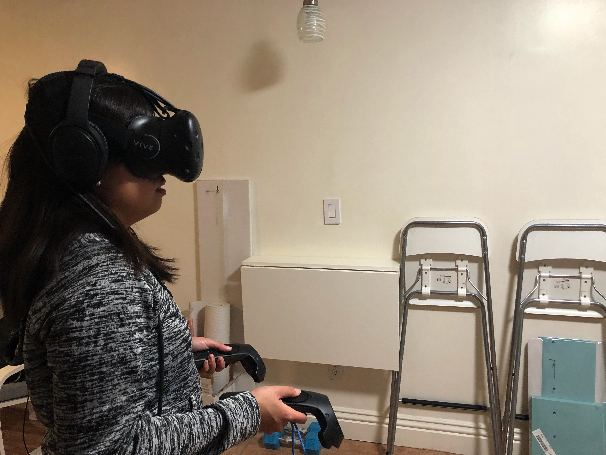

## Context

I did this user test right after I was done with all the major pieces of the game play. The intention was to see if the entire experience flows and makes sense.

The tester was my colleague Yvette Chua. She is interested in the VR space, but does not own a headset, and does not have a lot of experiences.

## Notes

#### Welcome Scene

The game begins with a very basic welcome scene, with no explanation, just "Welcome" and "Start", because I haven't got to those. 

Yvette pointed out that she wouldn't even know it's a room escape game if I hadn't told her. 

I implemented a canvas that follows the headset movement to make sure the user never have to look for it. Yvette thinks it's cool and brings a sense of dimension. She also pointed out that it's weird that the dialog box doesn't change or disappear when she tries to look around.

I noticed that Yvette had her finger always touching both touch pad. So there are two pointers visible all the time. This was not what I expected, so I might consider change the pointers from touch to show to press to show.

Yvette had no trouble figuring out how to click "Start".

#### Storyline

Upon clicking the start, a mock intro narration played. I used a machine voice, and she pointed out that's awkward to listen. She also pointed out that the narration was too long, and without any visual element, she lost track in the 3rd paragraph. 

She liked the story and the hook. She pointed out that in the story, the sorcerer left with a weak reason, and suggested that I find a stronger reason for it. She liked the music.

Another flaw in the experience was that when she first listen to the intro, she's standing at the edge of the room scale, and was seeing blue indicator lines all the time. She thought that's part of the game's visual and got confused. The second time I had her stand in the very middle of the room, and she reported the experience to be much better: "Feels like I'm actually traveling."

#### Tutorial Scene

I thought I had the tutorial part done, but when we tested this part, it was very buggy. I had to stop the program multiple times and make quick Unity fixes to make it work again. Seeing Yvette struggle through the broken experience, I still learned a few things.

The labels on the controllers are crucial to the experience, she had no knowledge of the name of the buttons.

Yvette tried to use the pointer to pick up things rather than reach out with the controller. She didn't get that she needs to hold the trigger to keep grabbing the object, either. When we talked about this, she said she's still in the mindset of using controller to play a game rather than her body.

I also tried to hide and show objects in the tutorial so the user can only interact with the things being talked about. Yvette found it confusing that the room changes and things appears and disappears without notice. She suggested that I just show everything at once, and refer to the objects by their names.

Another glitch I noticed is that when the key falls on to the floor, the collider was not working correctly and she can't pick it up.

#### Game Play

The game play experience was rather short as I didn't have the time to make more puzzle pieces. However, it went much better than the tutorial. Yvette was challenged a little bit and managed to escape pretty fast. 

With the "walk" locomotion, it's sometimes glitchy when the character walks on stairs. That's something I will try to fix.

The door in the room isn't "solid" and Yvette actually peaked out of the door. That broke the experience a little.

Yvette wished there to be a walk backward button in addition to the forward button.

The clue map I draw wasn't that clear when it's put in the scene. It rendered a lot smaller than I thought, and Yvette didn't try to read it. She was just looking for colors. I will make it more apparent.

Yvette didn't feel much dizziness throughout the experience. The only time she did was when the headset collide with other objects.

Yvette found it difficult to teleport while grabbing an object in hand. She dropped it accidentally.

## Things to Change upon Feedbacks

- Put more context in the welcome scene
- Better controller labels
- Edit / shorten the story. Change the end to give the sorcerer a stronger reason to leave the room
- Make all the furnitures in the tutorial room visible from the beginning.
- Fix walk glitches with VRTK
- Prevent user from leaving through the door
- Update the clue drawing

## Things to Consider and Change in the Future

- Touch to show pointer or press to show pointer
- Maybe add walk back function
- Re-consider the user has to hold the trigger button to keep grabbing the object
- Use human voiceovers
- Add visuals to the story intro
