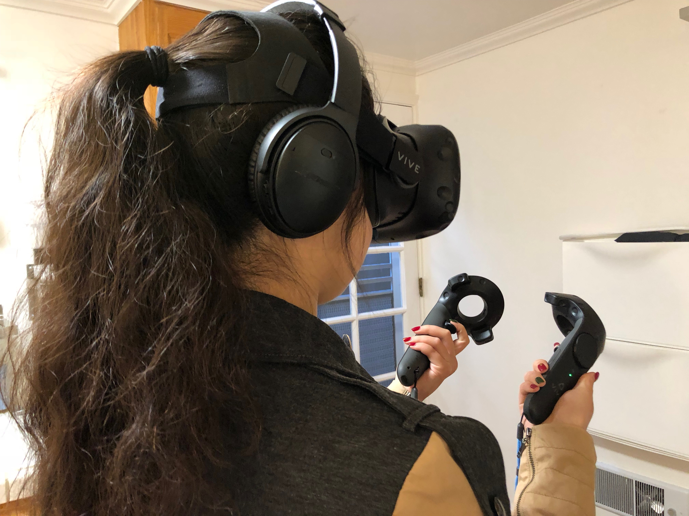

## Context

I did this user test after fixing most of the bugs from the first user test. I made the tutorial elements all appear at once. I also added count down timer, new skybox and UI elements, and options to skip storyline and tutorial. One thing that I didn't change is the storyline - didn't have the time to add visual elements and re-generate voiceover. The goal is to see if the fixes works and if the user flow is now good.

The tester is my friend Fiona, she is a freshman at UCSB. She had no previous experiences in VR, but I had her run through SteamVR's VR tutorial prior to the test.

## Notes

#### Welcome Scene

Fiona found the welcome scene simple to use. For the new skybox and UI elements, she find the welcome scene to be quiet and not scary. Judging from the welcome scene, she thought the game isn't going to be easy. 

She referred to the tooltip and clicked the start button with no problem. She also had no trouble understanding other parts of the canvas UI.

#### Storyline

Fiona thought the storyline is on par with the other games she played. 

She also mentioned that the storyline seems too long with out any visual elements. Even a progress bar would help. She liked the BGM.

#### Tutorial Scene

During the user test, I found another bug in the tutorial scene that it sometimes skips the teleportation part. Fiona didn't learn teleportation in the first run. It led to some interesting findings later on.

Fiona found it confusing that all 4 grip buttons can be used to walk. She mentioned that she would like to have more opportunities to play with them before moving on to the next action.

When learning how to grab objects, she didn't know that she's supposed to grab the key on the table. She tried to grab the desk and the chest and failed. 

Fiona also had trouble finding the button in the room.

In the voiceover, it mentioned that there will be countdown in the menu, but it wasn't there in the tutorial scene. The voiceover also didn't mention that clicking the menu again is another way to exit out of the menu, and Fiona got confused for a sec. She figured it out by herself later on.

#### Game Play

Because Fiona learned walking first and didn't learn teleportation in the first run, she used walking 80% of the time and only used teleportation for long distance moves. (For Yvette the other tester who learned both walking and teleportation, teleporting is the dominant way of moving.) Fiona mentioned that she's getting dizzy walking around. From my observation is from the stair glitch (seems to be a VRTK bug), and from colliding with objects. She said the walking speed is good. And for teleportation, maybe it's because she learned it later, she found it confusing and needed to look around and understand where she is now after each teleportation.

Unlike Yvette, Fiona always reach out her hand to grab objects and didn't try to use controller to grab objects. Maybe it's because she went through the SteamVR tutorial first. However, she still misses a lot of times grabbing things, I could consider enlarge the grabbing area for the controllers.

The cabinet door also have a glitch that Fiona felt like it's elastic.

Fiona had no problem finding the marbles, but she had to go back and forth to the clue wall to make sure she remember the marbles order right.

Fiona really wanted a congrats screen (and maybe fireworks) when she beats the game.

## Things to Change upon Feedbacks

- Voiceover
    - Shorten the storyline
    - Add "grab the key on the table" and maybe SFX
    - Similarly, add SFX and hint for where the button is
    - Add hint about hitting the menu button again will close the menu
    - Add voice feedback for winning vs. losing
- Add mock countdown to the tutorial scene
- Change stairs to slopes

## Things to Consider and Change in the Future

- Adding a "move on" UI for each tutorial step, so the player can make test each action multiple times
- Consider enlarge the grabbing area for controllers
- Fix VRTK glitches
